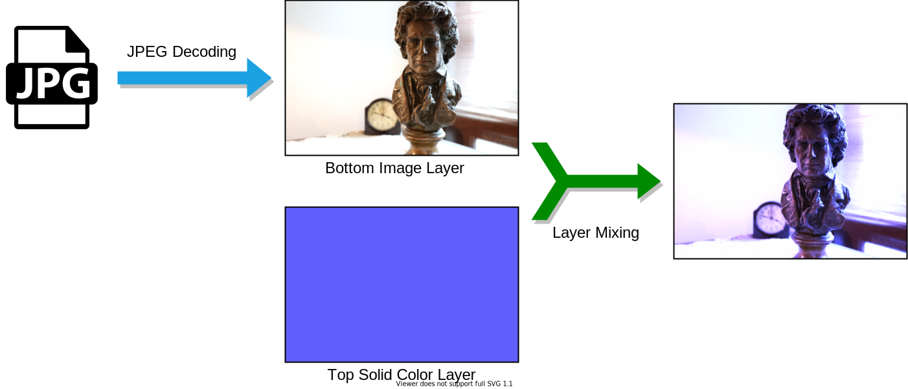
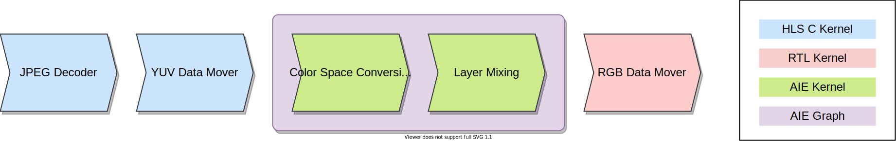
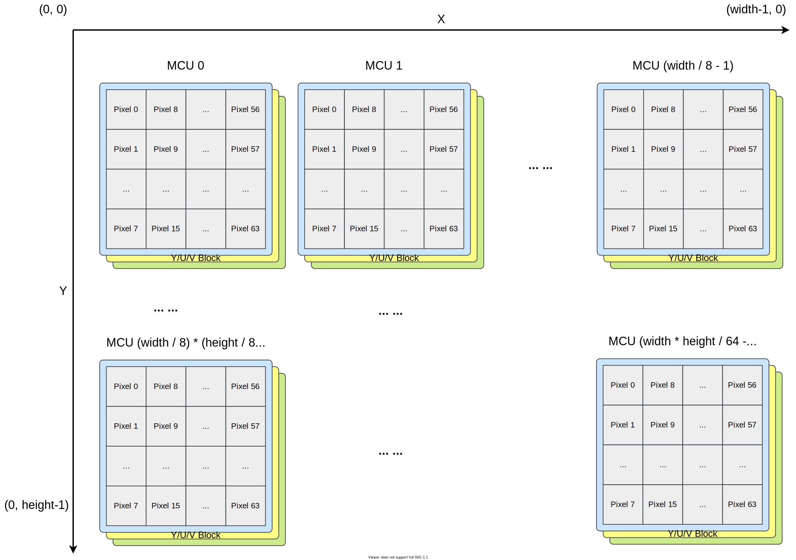
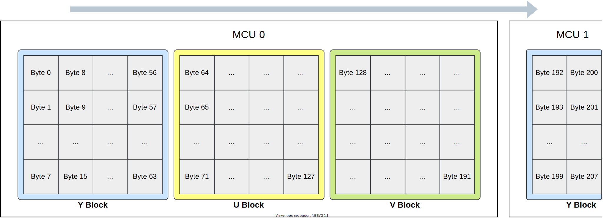
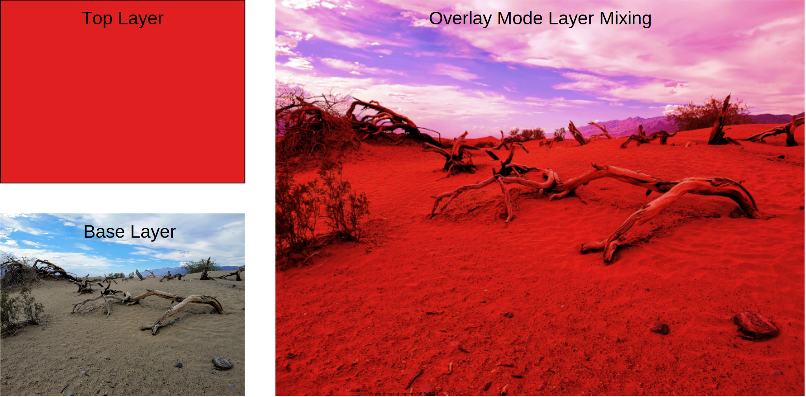
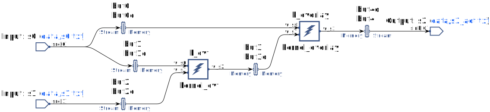
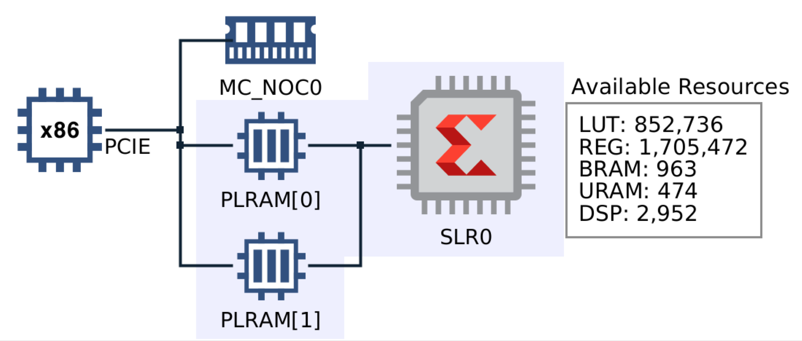

# Mixed Kernels Example Design on VCK5000 Using Vitis

***Version: Vitis 2022.2***

## 1 Introduction

This example demonstrates the development flow of a simple mixed kernels designs on VCK5000. The design includes RTL kernel, HLS kernel and AIE graph, which are integrated and deployed on VCK5000 accelerator card. JPEG decoder HLS kernel in the Vitis Library is also used here. Following figure show the processing flow of the example design. The design reads the JPEG input file from disk, transfers it to VCK5000, then decodes it when hardware JPEG decoder kernel. Then the decoded image will be mixed with another solid color layer. Finally the mixed image will be written into disk as BMP format image file along with the original decoded image.

All the computing loads in the figure above is finished by VCK5000 accelerator, and the host CPU handles file input/output operation only. The processing flow uses three types of kernel, utilizing both the AI Engine part and programmable logic (PL) part of the VCK5000 Versal device. Following block diagram depicts the module partition of the flow.

The whole processing flow includes following modules:
+ HLS Kernel: JPEG decoder
+ HLS Kernel: YUV data mover
+ RTL Kernel: RGB data mover
+ AIE Graph: image processing
  + AIE Kernel: color space conversion
  + AIE Kernel: layer mixing

JPEG decoder is an HLS Kernel which utilize the image CODEC functions in Vitis Libraries. The mover kernels handles the data source and sink for AIE graph. The input YUV data mover is implemented with HLS C and the output RGB data mover is implemented with Verilog RTL. The AIE graph implements the simple image processing flow, includes two kernel: one for color space conversion (YUV to RGB) and another one for layer mixing operation. These kernels will be further explained in following sections and the top level hardware / software integration steps will be shown at the last.

The example design is implemented and tested in following VCK5000 platform and XRT version with Vitis 2022.2 release.

* VCK5000 Platform: xilinx_vck5000_gen4x8_qdma_2_202220_1
* XRT Version: 2.14.354

XRT Native API is used for host program to control the kernels. Following are some sub-directories and files explanation of the example design working directory.

~~~
├── Makefile                              # Top level makefile to finish the whole flow
├── aie_overlay/                          # AIE kernels and graph directory
├── common/                               # Common codes used by both AIE kernel and host program
├── hw/                                   # Top level hardware build
├── krnl_jpeg/                            # JPEG decoder HLS kernel directory
├── krnl_rgb_mover/                       # RGB data mover RTL kernel directory
├── krnl_yuv_mover/                       # YUV data mover HLS kernel directory
├── sample_images/                        # Sample image for testing
└── sw/                                   # Host program for hardware and hardware emulation
~~~

Before going through following sections, please ensure you have source the XRT setup script and Vitis set script, for example:

~~~shell
source /opt/xilinx/xrt/setup.sh
source /tools/Xilinx/Vitis/2022.2/settings64.sh
~~~

Also If you are using RedHat/CentOS 7, the default installed GCC version is 4.x.x. You must use the following command to install and switch to GCC 7 before compiling the host program.

~~~shell
sudo yum install centos-release-scl
sudo yum install devtoolset-7-gcc-c++
scl enable devtoolset-7 bash
~~~

## 2 JPEG Decoder Kernel: krnl_jpeg

**krnl_jpeg** is an HLS kernel using JPEG Decoder API from [Vitis Codec Library](https://xilinx.github.io/Vitis_Libraries/codec/2021.2/index.html). This API supports the ‘Sequential DCT-based mode’ of ISO/IEC 10918-1 standard. It is a high-performance implementation based-on Xilinx HLS design methodology. It can process 1 Huffman token and create up to 8 DCT coefficients within one cycle. It is also an easy-to-use decoder as it can direct parser the JPEG file header without help of software functions. The JPEG Decoder API itself supports 4:4:4, 4:2:0, 4:2:2 and other YUV subsample format. However for simplicity purpose, in this example design we only handles YUV 4:4:4 format with baseline profile in downstream processing (including downstream hardware kernel and software). A few JPEG images are provided in ./sample_images directory abide by this rule.

Following subdirectory includes all the relevant codes for **krnl_jpeg**.  

~~~
├── krnl_jpeg/
│   ├── Makefile                          # Makefile for kernel simulation and compilation
│   ├── include/                          # JPEG decoder related source codes from Vitis Library
│   ├── krnl_jpeg.cpp                     # JPEG decoder HLS kernel source code
│   ├── krnl_jpeg.hpp                     # JPEG decoder HLS kernel header
│   └── krnl_jpeg_test.cpp                # JPEG decoder HLS kernel test code
~~~

**krnl_jpeg.cpp** includes the kernel source code. The kernel uses one pointer for input JPEG data, one pointer for output YUV data, and another pointer for output image information data. All these three memory-mapped pointer are bonded to an AXI master port. The only running argument of the kernel is input JPEG file size, it is bonded to an AXI control slave along with the three pointer offsets value. For YUV 4:4:4 format JPEG image, the full picture is divided to 8x8 pixels MCU (minimal coding unit) tile, each MCU includes 64 pixels, the MCU mapping of the full picture is shown in following figure.

For YUV 4:4:4 format JPEG image, each MCU includes one 8x8 Y component block, one 8x8 U component block and one 8x8 V component block. The output pixels byte streams by the JPEG decoder are arranged in column wise in each Y/U/V block of each MCU. Following figure depicts the JPEG decoder kernel output pixel stream order. The downstream image assembling process should re-order the pixels data to normal line scanning manner for BMP image generation.

**krnl_jpeg_test.cpp** is the C language testbench program which runs on x86 CPU. The testbench program reads in the JPEG file, calls the kernel function, convert the YUV data to RGB format, re-order the pixels and finally writes out the BMP file. Using C language testbench program can quickly verify the functional correctness of the kernel in early stage, much faster than RTL simulation in later hardware emulation stage.

Now enter the *krnl_jpeg* directory, then use following command to compile the C language testbench:

~~~
make compile_sim
~~~

Then an executable file named **krnl_jpeg_test** will be generated in current directory, and you can run it will following command line:

~~~
./krnl_jpeg_test -i ../sample_images/statue.jpg
~~~

After the execution finish, a BMP file named **decoded.bmp** will be written to current directory, and you can use any image viewer to see whether the JPEG decoding is correct.

Then you can use following commands to compile the HLS C code into Vitis kernel for hardware or hardware emulation target.

For hw target:

~~~
make compile
~~~

For hw_emu target:

~~~
make compile TARGET=hw_emu
~~~

Finally the kernel file named **krnl_jpeg_hw.xo** or **krnl_jpeg_hw_emu.xo** will be generate depending on your target selection.

## 3 AI Engine Kernel and Graph

The subdirectory **aie_overlay** contains all the AI Engine related codes, following is the directory structure.

~~~
├── aie_overlay
│   ├── data/                             # Test data and the generator
│   │   └── test_data.cpp                 # Test data generation program
│   ├── Makefile                          # Makefile for AIE graph simulation and compilation
│   └── src/                              # AIE kernel and graph source codes
│       ├── graph.cpp                     # AIE graph definition
│       ├── graph.h                       # AIE graph definition
│       ├── kernel_cvt.cpp                # AIE kernel for color space conversion
│       ├── kernel_cvt.h                  # AIE kernel for color space conversion
│       ├── kernel_overlay.cpp            # AIE kernel for layer mixing
│       └── kernel_overlay.h              # AIE kernel for layer mixing
~~~

The example design uses AI Engine to finish YUV-to-RGB color spacing conversion and image layer mixing functions, which are implemented in two AIE kernels: **kernel_cvt** and **kernel_overlay**. 

Color space conversion is widely used operation in image processing flow. The coded image data by JPEG decode is in YUV format and it needs to be converted to RGB format for layer mixing and Bitmap file generation. The YUV-to-RGB conversion used in this example design is as the below formula:

Layer mixing/blending is another common operation in image processing. Such as in Adobe Photoshop software, there are different types of image layer blending options, such as *Normal*, *Dissolve*, *Darken*, *Multiply*, etc. In the example design, we implement the *Overlay* mixing mode. The official definition of *Overlay* mode in Photoshop is: 

> Multiplies or screens the colors, depending on the base color. Patterns or colors overlay the existing pixels while preserving the highlights and shadows of the base color. The base color is not replaced, but mixed with the blend color to reflect the lightness or darkness of the original color.

The *Overlay* operation uses below formula, where *a* is the base layer value and *b* is the top layer value (here the value of pixel *a* and *b* is from 0 to 1).

Depending on the value a of the base layer, one gets a linear interpolation between black (a=0), the top layer (a=0.5), and white (a=1). From actual effect of layer *Overlay* mixing operation: where the base layer is light, the top layer becomes lighter; where the base layer is dark, the top becomes darker; where the base layer is mid grey, the top is unaffected. For a color image, this operation is applied to each channel (R, G, and B) of the image. To simplify the design, we mixed an decoded image layer with a solid color layer here, where the image is the base layer and the solid color is the top layer. Like following figure, the base layer and op layer on the left are mixed to get the image on the right.

These two kernels for color space conversion and layer mixing work in the pipeline fashion, the input data are feed into **kernel_cvt**, the output data from **kernel_cvt** are then sent to **kernel_overlay**, then the output data are put into downstream processing flow. 

These two kernels uses asynchronous window for data exchange. There are two kinds of data stream transferred in the window: image data and control data. The image data stream includes YUV data from JPEG decoder to **krnl_cvt**, RGB data from **krnl_cvt** to **krnl_overlay** and RGB data from **krnl_overlay** to downstream processing. For control data, these two AIE kernels use a common 64 bytes control packet to transfer running parameters, which is described in the *~/common/common.h* file, pasted as below. The parameters include the size of the image, top overlay layer color and numbers of MCU blocks in JPEG file.

~~~C++
//S0 control packet, 16 word (64 bytes) total
struct overlay_S0_control
{
        //Parameters
        uint32_t IMG_W;  // image width
        uint32_t IMG_H;  // image height
        uint32_t OVL_R;  // overlay layer color, Red
        uint32_t OVL_G;  // overlay layer color, Green
        uint32_t OVL_B;  // overlay layer color, Blue
        uint32_t MCU_N;  // JPEG minimal code unit number of JPEG file
        uint32_t RSVD[10]; // reserved words to fill up the 64 byte packets
};
~~~

Please note the purpose of this example design is to demonstrate the development flow with AIE on VCK5000, so no optimization is applied on the AIE kernel source code, standard C scalar semantics are used here. 

#### AIE Kernel: kernel_cvt

**kernel_cvt** finishes the color space conversion task. The function prototype of the kernel is like below:

~~~C++
void kernel_cvt(input_window_uint32* restrict w_s0, 
                input_window_uint8* restrict w_s1, 
                output_window_uint8* restrict w_s2);
~~~

Three asynchronous windows are used here:
* *w_s0*: for control packet, window size 64 bytes (16 words)
* *w_s1*: for input YUV data in an MCU, window size 192 bytes (64 bytes for each of Y, U and V components)
* *w_s2*: for output RGB data corresponding to a JPEG MCU, window size 192 bytes (64 bytes for each of R, G and B components)

#### AIE Kernel: kernel_overlay

**kernel_overlay** finished the image layer mixing task. The function prototype of the kernel is similar to **kernel_cvt** with exception of the data width of window *w_s2*:

~~~C++
void kernel_overlay(input_window_uint32* restrict w_s0, 
                    input_window_uint8* restrict w_s1, 
                    output_window_uint32* restrict w_s2);
~~~

Three asynchronous windows are used here:
* *w_s0*: for control packet, window size 64 bytes (16 words)
* *w_s1*: for input RGB data corresponding to a JPEG MCU, window size 192 bytes (64 bytes for each of R, G and B components)
* *w_s2*: for output RGB data corresponding to a JPEG MCU, window size 256 bytes (64 words, each word represents an RGBA format pixel)

#### AIE Graph: graph_overlay

The AIE graph **graph_overlay** includes the two AIE kernels, as shown in below figure.

The port *s0* and *s1* of **graph_overlay** are input port while *s2* is output port. *s0* is connected to the *w_s0* windows of both the two kernels since it provides the common control packets. *s1* is connected to window *w_s1* of **kernel_cvt** and *s2* is connected to window *w_s2* of **kernel_overlay**. The *w_s2* window of **kernel_cvt** is connected to *w_s1* of **kernel_overlay** inside the graph.

The graph class definition can be found in source code file *graph.h*, posted as below. The asynchronous window sizes are defined in the code. Please note the input and output files for simulation are referred when creating PLIO object. The generation of the input and output files is described in the next sub-section.

~~~C++
#include <adf.h>
#include "kernel_overlay.h"
#include "kernel_cvt.h"

using namespace adf;

class graph_overlay: public graph
{

private:
	kernel k_cvt;
	kernel k_overlay;

public:
	input_plio p_s0;
	input_plio p_s1;
	output_plio p_s2;

	graph_overlay()
	{
		// create kernel
		k_cvt =  kernel::create(kernel_cvt);
		k_overlay = kernel::create(kernel_overlay);

		// create port
		p_s0 = input_plio::create("s0", plio_128_bits, "data/s0.txt");
		p_s1 = input_plio::create("s1", plio_128_bits, "data/s1.txt");
		p_s2 = output_plio::create("s2", plio_32_bits, "data/s2_act.txt");

		// connect port and kernel
		connect<window<64>>(p_s0.out[0], async(k_overlay.in[0]));
		connect<window<64>>(p_s0.out[0], async(k_cvt.in[0]));
		connect<window<192>>(p_s1.out[0], async(k_cvt.in[1]));
		connect<window<192>>(async(k_cvt.out[0]), async(k_overlay.in[1]));
		connect<window<256>>(async(k_overlay.out[0]), p_s2.in[0]);

		// set kernel source codes
		source(k_cvt)     	= "src/kernel_cvt.cpp";
		source(k_overlay) 	= "src/kernel_overlay.cpp";
		headers(k_cvt) 	  	= {"src/kernel_cvt.h","../common/common.h"};
		headers(k_overlay)	= {"src/kernel_overlay.h","../common/common.h"};

		// set ratio
		runtime<ratio>(k_cvt)     =0.9;
		runtime<ratio>(k_overlay) =0.9;

	};

};
~~~

The graph instance in the platform can be found in *graph.cpp*, pasted as below:

~~~C++
#include "graph.h"

using namespace adf;

graph_overlay my_graph;

int main(int argc, char ** argv)
{
	my_graph.init();
	my_graph.run();
	my_graph.end();
	return 0;
}
~~~

 In the *main* function, *my_graph.run()* is called without parameters, which means the graph will be in alway-run style, namely when one iteration of execution finishes, the graph will start again and pause at the window data (control packet) acquisition position.

#### Usage Steps

##### 1. Generate Simulation Dataset

Generally the first step to verify the AIE kernels is simulation (with AIE simulator or x86 simulator), and test data is required. A test data generation C program **test_data.cpp** is provided in *./aie_overlay/data* directory. This program generates random YUV format image, finishes color space conversion and layer mixing, then writes out the source and result dataset as text files as the input to the AIE kernels. Finish the data generation as following steps:

~~~bash
cd ./aie_overlay/data
gcc -o test_data.exe test_data.cpp
./test_data.exe
~~~

After these steps, three output files are generated: *s0.txt*, *s1.txt* and *s2_exp.txt*. *s0.txt* and *s1.txt* are for stimulus to the graph ports *s0* and *s1*, while *s2_exp.txt* is for reference data from output graph port *s2*.

##### 2. Build the Graph and Run Graph Simulation

You should first build the **aiecompiler** to build the AIE graph, then run simulation to verify the graph. There are two kinds of simulator provided by Vitis: AIE simulator and x86 simulator. x86 simulator is much faster than AIE simulator but it cannot detect some low level mistakes in graph, such as window size mismatch, etc. So you can run the simulation with x86 simulator for fast prototype then run with AIE simulator for accurate kernel and graph verification.

To build the graph and run in AIE simulator mode:

~~~
cd ./aie_overlay
make clean
make aie_compile
make aie_simulate
~~~

To build the graph and run in x86 simulator mode:

~~~
cd ./aie_overlay
make clean
make aie_compile_x86
make aie_simulate_x86
~~~

At the end of simulation of each mode, you should press *ctrl-c* to break the running, because the AIE graph is in always-running mode in graph code. You can also modify the graph run iteration time to 1, so that the simulation can stop at the end (remember to change it back before you start hardware building):

~~~C++
   my_graph.run(1);
~~~

The simulation log should looks like below:

~~~
make aie_simulate_x86
INFO:- - - - - - - - - - - - - - - - - - - - - - - - - - - - - - - - - - - - - - - - - - 
INFO:Running aiesimulator...
INFO: Reading options file './Work/options/x86sim.options'.
Calling adf::graph::run() without specifying number of iterations ... It will either 
run AIE cores indefinitely, or run AIE cores for the last specified iterations if 
adf::graph::run(iterations) was called before.
[KERNEL_OVERLAY] finish processing of MCU 0
[KERNEL_OVERLAY] finish processing of MCU 1
[KERNEL_OVERLAY] finish processing of MCU 2
[KERNEL_OVERLAY] finish processing of MCU 3
[KERNEL_OVERLAY] finish processing of MCU 4
[KERNEL_OVERLAY] finish processing of MCU 5
[KERNEL_OVERLAY] finish processing of MCU 6
[KERNEL_OVERLAY] finish processing of MCU 7
[KERNEL_OVERLAY] finish processing of MCU 8
[KERNEL_OVERLAY] finish processing of MCU 9
[KERNEL_OVERLAY] finish processing of MCU 10
[KERNEL_OVERLAY] finish processing of MCU 11
[KERNEL_OVERLAY] finish processing of MCU 12
[KERNEL_OVERLAY] finish processing of MCU 13
[KERNEL_OVERLAY] finish processing of MCU 14
[KERNEL_OVERLAY] finish processing of MCU 15
[KERNEL_OVERLAY] finish one iteration
~~~

Finally you will get a output file *s2_act.txt* in */x86simulator_output/data/* or */aiesimulator_output/data/* directory depending on your mode selection.

##### 3. Build the Graph for Hardware Building

In fact if you have run the simulation with AIE simulator mode, the **libadf.a** file needed for hardware building has been generated. If not, use following command to build it:

~~~
cd ./aie_overlay
make clean
make aie_compile
~~~

After the successful compiling, the **libadf.a** file will be generated in *./aie_overlay* directory, which will be used later for top level hardware building.

## 4 Data Mover

In this example design, AI Engine uses AXI stream ports for data exchange with other logics, so data movers are required to feed input data to the AIE graph and take output data from the AIE graph. There are two data mover kernels used in the design, YUV data mover **krnl_yuv_mover** for input data and RGB data mover **krnl_rgb_mover** for output data.

#### HLS Kernel: krnl_yuv_mover

**krnl_yuv_mover** is a simple HLS kernel to convert AXI Memory Mapped transaction to AXI stream, namely the AXI-to-AXIS bridge. It has one AXI master port and two AXI stream ports which provides two-way AXI stream connection to AIE units. There are an address offset pointer and a transfer size argument for each AXI stream port. Because it is so simple, so no simulation environment is provided here. You just need to run the commands below to build the kernel:

~~~
cd ./krnl_yuv_mover
make compile
~~~

This will generate kernel file *krnl_yuv_mover_hw.xo* for later hardware building process.

If you are running the hardware emulation flow, use following command instead, then kernel file *krnl_yuv_mover_hw_emu.xo* will be generated accordingly.

~~~
make compile TARGET=hw_emu
~~~

#### RTL Kernel: krnl_rgb_mover

**krnl_rgb_mover** is a RTL kernel to convert AXI stream transaction to AXI Memory Mapped access. One key difference of the **krnl_rgb_mover** design from common AXIS-to-AXI bridge is that it also handles the pixel reordering jobs. As described in [2 JPEG Decoder Kernel: krnl_jpeg](#2-jpeg-decoder-kernel-krnl_jpeg), the output pixel order of JPEG coder is divided into MCUs and column-wise in each MCU. For AIE graph and kernels, since all the operation are pixel wise, namely the input pixel order have no effects on the result, so the **krnl_yuv_mover** doesn't re-arrange the pixels. But if we need to write the pixel data to a Bitmap file, these pixels must be in line scan format. So the RTL kernel **krnl_rgb_mover** finishes the pixel reordering jobs when write the input AXI stream data to memory via AXI port. The kernel calculates the address offset of each input pixel according to the image width and height arguments, then write them into appropriate memory positions.

To integrate the RTL design with Vitis, we need to pack the RTL code to kernel file (XO file). We provides a script to utilize Vivado IP packager to finish the process. Just use following commands to finish the RTL kernel packing jobs:

~~~
cd ./krnl_rgb_mover
make pack_kernel
~~~

Finally the kernel file **krnl_rgb_mover.xo** will be generated, which can be used for both *hw* and *hw_emu* targets.

Moreover, this example design provides a simple simulation environment to verify the RTL design. The testbench generates a random 128x64 resolution image, sends it to **krnl_rgb_mover** via AXI stream master VIP, then receive and validate the written data from **krnl_rgb_mover** by AXI slave VIP. Use following command to generate AXI verification IP and run the simulation with Vivado XSIM tool.

~~~
cd ./krnl_rgb_mover
make gen_vip
make runsim
~~~

After the simulation finished, following message will be printed out:

~~~
              576894       [CHECK] Data check SUCCEED!
~~~

## 5 Top Level Hardware Integration

Top level hardware integration means to connect all the hardware acceleration kernels (including AIE graphs) with the platform and finish full synthesis and implementation flow. The base VCK5000 platform topology is shown in below figure. One global memory bank named *MC_NOC0* and two PLRAM slices are provided. One SLR (Super Logic Region) is provided to contain customer hardware acceleration kernel and AIE units.

For this example design, we need to connect our AIE graph, HLS kernels and RTL kernel to the platform. To finish this, we use Vitis *v++* tool to link and package all the designs to *XSA* file. The linking process is to put together all the hardware logic (including AIE unit), finish place and routing jobs by Vivado and generate an intermediate XSA file **overlay_hw.xsa** or **overlay_hw_emu.xsa**. The packaging process then attach the compile AIE code and finally generate the **overlay_hw.xclbin** or **overlay_hw_emu.xclbin** files, which can be directly used by host program in hardware or hardware emulation running.

Use following commands to finish this hardware building step for hardware running, and the **overlay_hw.xsa** and **overlay_hw.xclbin** files will be generated:

~~~
cd ./hw
make all
~~~

Use following commands to finish this hardware building step for hardware running, and the **overlay_hw_enu.xsa** and **overlay_hw_emu.xclbin** files will be generated:

~~~
cd ./hw
make all TARGET=hw_emu
~~~

The makefile calls Vitis **v++** command line to finish hardware building. Generally the hardware building flow is same as convention Vitis based flow with other acceleration target platform (such as Alveo) except for the additional *packaging* step for Versal platform. The *connectivity* section of the configure file *./hw/xclbin_overlay.cfg* defines the kernel instantiation, the connection topology and global memory usage like below.

~~~
[connectivity]
nk=krnl_yuv_mover:1:krnl_yuv_mover_0
nk=krnl_rgb_mover:1:krnl_rgb_mover_0
nk=krnl_jpeg:1:krnl_jpeg_0

slr = krnl_yuv_mover_0:SLR0
slr = krnl_rgb_mover_0:SLR0
slr = krnl_jpeg_0:SLR0

sp = krnl_jpeg_0.m_axi_gmem:MC_NOC0
sp = krnl_yuv_mover_0.m_axi_gmem:MC_NOC0
sp = krnl_rgb_mover_0.axi_wmst:MC_NOC0

stream_connect=krnl_yuv_mover_0.stream_s0:ai_engine_0.s0
stream_connect=krnl_yuv_mover_0.stream_s1:ai_engine_0.s1
stream_connect=ai_engine_0.s2:krnl_rgb_mover_0.axis_slv
~~~

Following is the block diagram of the successfully built hardware topology reported by *vitis_analyzer*.

## 6 Host Program

For VCK5000 platform, the x86 host side programming has no difference with other Alveo accelerator cards. You can use XRT Native API or Xilinx OpenCL API extension to transfer data to/from the cards, configure the acceleration kernel arguments and control the execution of the kernel. One thing to note is that the AIE units are not controlled by host side XRT API directly, but by control packets sent by the data mover in PL region (by **krnl_yuv_mover** in this example design). So in the example host program, we assemble the control packet data, transfer it to card, and sent it to AIE graph via data mover.

This host program is written with XRT Native API and finishes following tasks in order:
1. Loading **overlay_hw.xclbin** (or **overlay_hw_emu.xclbin** in case of hardware emulation) file to VCK5000 card (or hardware emulation platform), setup the kernel running context. The program will detect the status of environment *XCL_EMULATION_MODE* to select appropriate XCLBIN file.
2. Read the designated JPEG file as plain binary file to host and transfer it to the card
3. Run the JPEG decoder kernel, fetch the decoded YUV data stream and image information data from the card, then write out the **decoded.bmp** file for reference. Software based color space conversion and pixel reordering are carried out in this step.
4. Run the YUV data mover and RGB data mover kernels, transfer the YUV data and control packet to AIE graph, fetch the final RGB data from the card to host, and directly write out the **mixed.bmp** file for final processing result.

Please note in above process flow, the YUV data generated by the JPEG decoder are stored in a device buffer shared between JPEG decoder and YUV data mover, and finally delivered to AIE graph directly. So it is in zero-copy style, and eliminates the requirement for intermediate data duplication or movement.

To build the host program, follow below steps, and the executable **host_overlay.exe** will be generated in current directory, the makefile also links the required XCLBIN files built from previous steps.

~~~
cd ./sw
make all
~~~

To run the program, use following command line:

~~~
./host_overlay.exe -i JPEG_FILE [-c COLOR]
~~~

Where the JPEG_FILE is the input JPEG file. COLOR is an optional argument, and it is a 6-digit hexadecimal string to represent the RGB24 color for the solid color top layer for layer mixing operation: pure red solid color is FF0000, pure green solid color is 00FF00, pure blue solid color is 0000FF, etc. The default COLOR value defined in the program is 6060FF.

For example, use following command line to decode and mix one of the provided sample image and mix it with a kind of red color layer:

~~~
./host_overlay.exe -i ../sample_image/sand.jpg -c E02020
~~~

Actually this produces the demo layer mixing image used in [Section 3](#3-ai-engine-kernel-and-graph). Following is the running log of the command in hardware target mode.

~~~
./host_overlay.exe -i ../sample_images/sand.jpg -c E02020
Input JPEG file size = 1983165
Program running in hardware mode
Load overlay_hw.xclbin
Create kernels
Create input and output device buffers for JPEG decoder
Create runner
Read JPEG file and transfer JPEG data to device... Done
Run krnl_jpeg... Finish
Transfer YUV data to host... Done
Transfer Info data to host... Done
Successfully decode the JPEG file.
The JPEG file is decoded to image 'decoded.bmp' of 3648 by 2736
Transfer AIE ctrl packet to device... Done
Run krnl_yuv_mover and krnl_rgb_mover...
krnl_yuv_mover finish
krnl_rgb_mover finish
Transfer mixed RGB data to host... Done
The mixed image is written to 'mixed.bmp'.
~~~

By default the program runs in hardware mode. If you would run hardware emulation, run following command in *./sw* directory before you run *host_overlay.exe*:

~~~
source ./setup_emu.sh -s on
~~~

This will prepare the required JSON file for emulation and set the environment variable *XCL_EMULATION_MODE*. Because the hardware emulation flow is very slow, so here a small JPEG image file is provided, use following command to run the host program with this small input image in *hw_emu* mode:

~~~
./host_overlay.exe -i ../sample_image/statue_tiny.jpg
~~~

The *./sw/xrt.ini* file sets the XRT emulation debug mode to **batch** here, you can change it to **gui** to see the real time waveform in a Vivado xsim window and dump your interested signal waveforms during the running of the host program.

To turn off hardware emulation mode, use:

~~~
source ./setup_emu.sh -s off
~~~

**Note**: before you run the host program in hardware emulation mode, you must ensure that all the previous hardware related compiling and building procedures are done with *hw_emu* as target.

## 7 Top-down Flow Usage

In the top-level directory of the example design, a one-step building Makefile is provided for both hardware and software build. First use following command for hardware build:

~~~
make build_hw
or
make build_hw TARGET=hw_emu
~~~

Then use following command for software build:

~~~
make build_sw
~~~

After these two steps, all hardware and software is ready and you can enter *./sw* directory to use the executable *host_overlay.exe* as described previously.

## 8 Summary

From the example you can see that the development flow with VCK5000 is similar to traditional Alveo accelerator cards with the new added powerful AI Engine units. You can select appropriate acceleration engines between AIE kernel, RTL kernel and HLS kernel for different types of tasks, then stitch them together to form a uniformed adaptive acceleration solution.

## Revision History

  
2022.1

  - Update to latest gen4x8 production platform
  - Update aie graph code to 2022.1 tool recommended style

  
2021.2

  - Initial release

Copyright&copy; 2022 Xilinx
